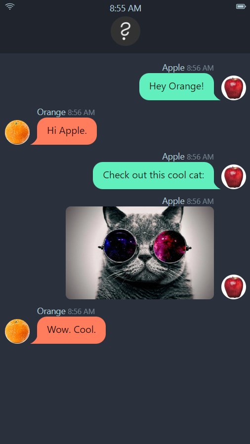

# Text Message Markdown

This is a svelte web application to simulate a texting conversation. It was built based on the features used in the original [React project](https://github.com/yojoecapital/texting-simulator).

## Live Site

Visit the site [here](https://yojoecapital.github.io/text-msg-md).



## Technologies Used

- [SvelteKit](https://kit.svelte.dev/)
- [tailwindcss](https://tailwindcss.com/)
- [daisyUI](https://daisyui.com/)

## Run Locally

```bash
git clone https://github.com/yojoecapital/text-msg-md.git
npm install
npm run dev
```

